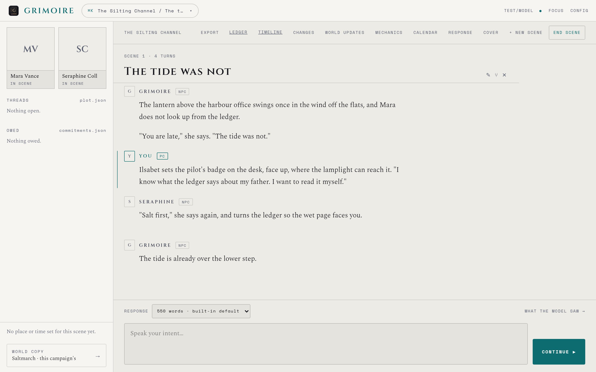
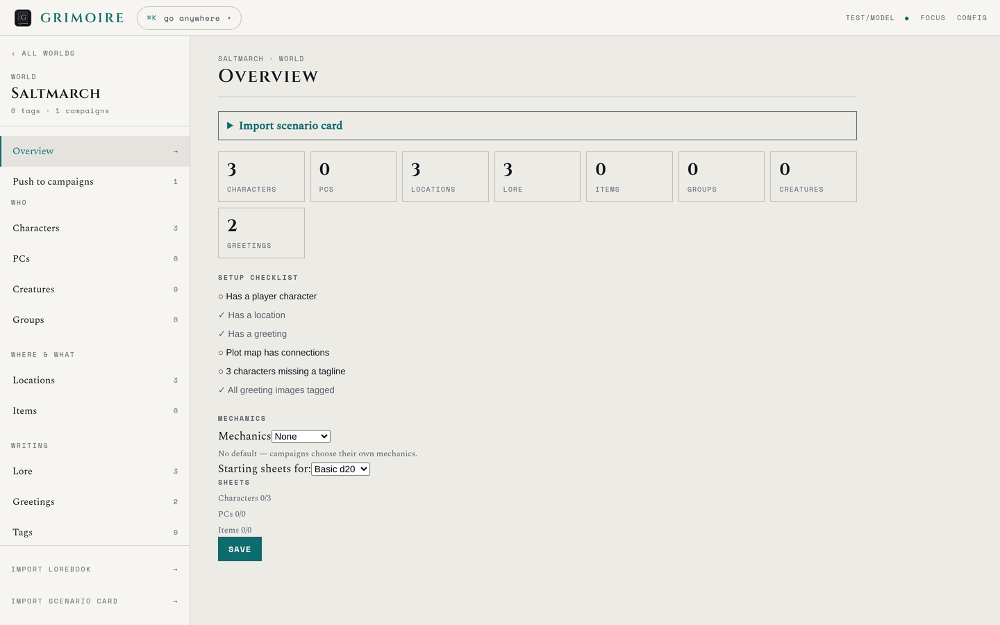
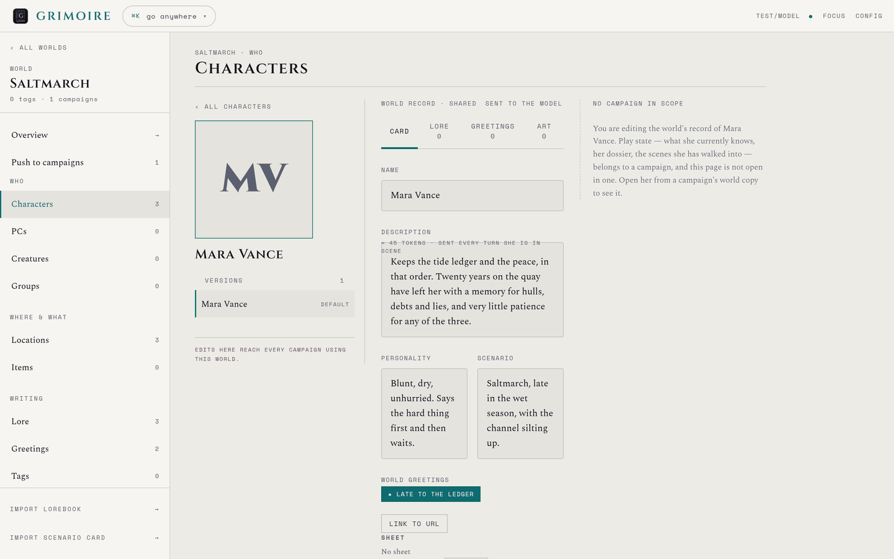
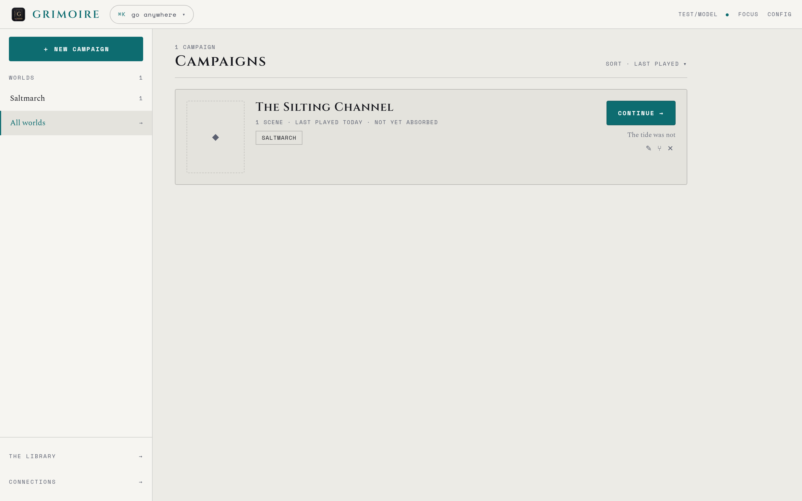

#  Grimoire

**Grimoire is a local-first app for AI-driven collaborative storytelling and
character roleplay.** It runs entirely on your own machine, talks to whichever
language model you choose through [OpenRouter](https://openrouter.ai/), and keeps
your whole library — worlds, characters, campaigns, and every scene you play — as
plain Markdown and JSON files under `~/.grimoire`. Nothing is locked in a
database or a cloud account: your stories are files you own.

## Status

Grimoire is in active development. The core loop — worlds, campaigns, scenes,
absorb — works, and the app is usable day to day.

The issue tracker is a working backlog rather than a defect list — an open issue
usually records a design decision made and not yet acted on.

## A look at it



*Playing a scene. The rail on the left carries who is present and what the
campaign still owes; the composer below sets response length and opens the prompt
inspector.*

| A world | A character |
| --- | --- |
|  |  |
| Characters, PCs, locations, lore and greetings — with a checklist of what the world still needs before it plays well. | Every record page is the same two-pane editor: pick on the left, read on the right, edit deliberately. |

*Every screenshot here is captured against a throwaway store seeded with invented
content — see [`docs/screenshots/README.md`](docs/screenshots/README.md) for why
that is a rule and not a convenience.*

## What the model saw

The scene inspector's **Context** panel breaks the assembled prompt down section
by section with token counts, showing anything the budget packer dropped.
**Turn history** beside it holds the same breakdown *frozen* for past turns, so
you can read the exact prompt a reply came from after the chronicle, cast, and
world info have all moved on.

This is the part of Grimoire worth stealing. A long campaign's context is
assembled from a dozen moving sources, and by the time a reply looks wrong every
one of them has changed. A breakdown that is only current is not evidence about
anything that already happened.

Configurable under Configuration → Context (Kept turn prompts; `0` records none).

## What it does

Grimoire organizes roleplay the way a long-running campaign actually works, with
three layers:

- **Worlds** — a setting and its cast. A world holds your **characters** (NPC
  cards), **PCs** (the personas you play), reusable **greetings** (scene
  openers), and worldbuilding records: **lore** and **locations**. Worlds can
  have their own calendar, tags, and colour theme.
- **Campaigns** — an ongoing playthrough set in a world. A campaign strings
  together scenes over time and keeps continuity for you: a **chronicle**
  (running recap/memory), **cast** with per-character **dossiers**, tracked
  **relationships**, open **plot threads**, character **state**, in-world
  **dates**, and a log of **changes** the story has made to the world.
- **Scenes** — the actual chat. You roleplay turn by turn against a streaming
  model response, with **retry** and **regenerate-with-guidance** when a reply
  misses, an **opener** generator to start a scene, and **scene suggestions**
  that propose what to play next based on where the campaign stands.

When a scene wraps, **absorb** distills it back into the campaign: it updates the
chronicle, refreshes each present NPC's dossier, and advances relationships, plot
threads, and character state — so the next scene starts from an up-to-date world.

### Other highlights

- **Import character cards** — bring in character cards (including PNG cards with
  embedded lorebooks) and import directly from [chub.ai](https://chub.ai/), with
  galleries, avatars, and multiple versions per character.
- **Export character cards** — send any version back out as JSON, PNG, or CHARX
  from the character editor's Export menu, avatar embedded, so the file carries
  the whole character into another app (or back into Grimoire).
- **Lorebooks / world info** — parse and import character-book / world-info
  entries into a world's lore.
- **LLM-generated taglines** and **image localization** for characters.
- **Model routing** — scene prose, absorb, dossier refreshes, summaries and the
  one-shot utilities can each run on a connection of their own, set under
  Configuration → Model routing and overridable per campaign from the scene
  inspector. Anything left on inherit uses the active connection, so an install
  that never opens the page keeps the single model it always had.
- **EPUB export** — turn a finished campaign into a readable book.
- **Editable prompts** — every prompt Grimoire sends to the model lives as a
  Jinja2 template under [`templates/`](templates/README.md). Edit a template and
  the change takes effect immediately; nothing prompt-shaped is hard-coded.
- **Themes** — ships with `codex`, `astral`, and `manuscript`.
- **Manual dice rolls** — roll dice mid-scene with the 🎲 button; see
  [Dice notation](#dice-notation) for the syntax.
- **Custom calendars** — the only built-in calendars are Gregorian and Hebrew
  (real-world, with their real holiday sets); everything else — homebrew
  fictional calendars, house rules, or a system like the Calendar of Harptos — is
  a plugin: drop a `.py` file implementing `CalendarProvider` (see
  `backend/src/grimoire/store/calendars/base.py` and `plugins.py` for the
  contract) into `<your grimoire home>/calendars/`, and it becomes choosable in
  the Calendar dropdown. Nothing under your data directory is git-tracked, so
  homebrew/personal calendars stay private.

### Dice notation

The 🎲 button in a scene's input bar takes a notation string:

```
[N]dM [khN|klN|dhN|dlN] [!] [+K|-K] [tN | vs N]
```

- **`NdM`** — roll `N` dice with `M` sides each. `N` defaults to 1, so `d20` is a
  single d20. Example: `2d6`.
- **`khN` / `klN`** — keep only the highest/lowest `N` dice. Example: `4d6kh3`
  (roll 4d6, keep the best 3).
- **`dhN` / `dlN`** — drop the highest/lowest `N` dice instead of keeping.
- **`!`** — exploding dice: any die that rolls its max face rolls again and adds
  on. Example: `5d6!`.
- **`+K` / `-K`** — a flat modifier added to the total. Example: `2d6+3`.
- **`tN`** — pool mode: count how many dice roll `N` or higher as successes,
  instead of summing. Doesn't take a modifier. Example: `7d10t6`.
- **`vs N`** — grade the summed total as success/failure against a target number.
  Example: `1d20+5 vs 15`.

`tN` and `vs N` are mutually exclusive with each other. Clauses can be combined
freely otherwise, e.g. `4d6kh3!+2`.

## Requirements

- **Python 3.11+**
- **Node 18+**
- An **[OpenRouter](https://openrouter.ai/) API key** (you supply the model;
  Grimoire defaults to `anthropic/claude-opus-4.1` and you can change it in the
  app).

## Install

Clone the repo, then run the installer for your platform. It creates the backend
virtualenv, installs the frontend packages, and adds a desktop launcher.

**macOS / Linux**

```sh
git clone https://github.com/charlesmsiegel/grimoire.git
cd grimoire
scripts/unix/install.sh
```

**Windows (PowerShell)**

```powershell
git clone https://github.com/charlesmsiegel/grimoire.git
cd grimoire
scripts\windows\install.ps1
```

The installer checks your Python and Node versions before it starts, and finishes
by printing the directory your library will live in — see
[Where your data lives](#where-your-data-lives) to move it somewhere else before
the first run. Nothing is written there until you actually use the app.

## Run

**macOS / Linux**

```sh
scripts/unix/run.sh
```

**Windows (PowerShell)**

```powershell
scripts\windows\run.ps1
```

This starts the backend (port **8173**) and the frontend (port **5173**) in the
**current terminal**, waits for both to be ready, opens
**<http://127.0.0.1:5173>** in your browser, and then streams both servers' logs
into that terminal so you can watch status and errors live. The installer also
drops a **Grimoire** launcher on your desktop that opens the same console.

**The terminal stays open while Grimoire runs.** Closing the window — or pressing
**Ctrl+C** — shuts down both servers cleanly (no leftover process holding a
port).

If you ever start Grimoire another way and need to stop it, the shutdown scripts
still work:

```sh
scripts/unix/shutdown.sh        # macOS / Linux
scripts\windows\shutdown.ps1    # Windows
```

## First steps

Grimoire opens on your campaigns — one row each, newest play first, with
**Continue** picking up the scene you left:



1. Open **Config** (top-right) and paste your **OpenRouter API key**. The status
   pill in the header turns to `CONNECTED`. Here you can also pick the model,
   theme, and the default system prompt.
2. Go to **Worlds → + New**, create a world, and add a character or two (build
   one by hand or import a card / a chub.ai character).
3. Add a **greeting** to open a scene, and optionally some **lore** and
   **locations**.
4. Go to **Campaigns → + New**, start a campaign in that world, and open a scene
   to begin playing. Use **absorb** when a scene is done to fold it into the
   campaign's memory.

## Where your data lives

Everything is stored as Markdown and JSON under a single data directory, resolved
by `store.home()` in this order:

1. the `GRIMOIRE_HOME` environment variable (used for tests / overrides), then
2. the path you choose on the **Config** page (recorded in the bootstrap pointer
   `~/.grimoire.json`), then
3. the default `~/.grimoire`.

`scripts/unix/install.sh` and `scripts\windows\install.ps1` print the resolved
path when they finish; to ask again later, run `python -m grimoire.where` from
the backend venv.

Because the whole library is just files, you can back it up, version it, or
**point the data directory at a synced folder (Dropbox, iCloud, etc.) to share
one library across devices** — change the **Storage location** on the Config
page.

### What this cannot promise

**Do not actively use Grimoire on two devices at once.** Sync clients resolve
simultaneous edits by making conflict copies on their own schedule, and Grimoire
cannot merge those — one side's edit wins and the other becomes a stray file. Let
the sync settle before switching devices.

Two Grimoire processes *on the same machine, signed in as the same user* fare
better: scene, sheet, proposal and module-pack writes lock against each other
across processes, so the desktop app and a dev server can share a store without
shredding a transcript. That is not a blanket guarantee — a few writers
(dice-roll history, campaign rename and delete, image assets) still don't
participate, and two different OS accounts sharing one store aren't covered — so
it makes accidents survivable rather than making two-at-once a supported way to
work.

The exact promises behind that paragraph — what is atomic, what the locks cover,
and what is deliberately not guaranteed — are written up in
[`docs/store-guarantees.md`](docs/store-guarantees.md).

## Android app

Grimoire also builds as an Android APK — the same app, unchanged: the APK embeds
the real backend (via [Chaquopy](https://chaquo.com/chaquopy/)) and the built
frontend in a full-screen WebView, storing its library under the app's files
directory. Build it from the repo root with GNU make (on Windows, run from Git
Bash; `winget install ezwinports.make` if you don't have make):

```sh
make android-bootstrap   # once per machine: JDK 17 + Android SDK + licenses (no admin needed)
make apk                 # debug APK -> build/grimoire-debug.apk
make apk-install         # build + adb install to a connected device
```

See [`android/README.md`](android/README.md) for details (prerequisites, release
builds, and the runtime layout on the device).

## Development

Grimoire is a **FastAPI** backend (`backend/`, pytest) plus a **Vite/React**
frontend (`frontend/`, vitest).

```sh
# Backend tests
cd backend && .venv/bin/python -m pytest -q          # macOS / Linux
#   backend\.venv\Scripts\python.exe -m pytest backend -q   (Windows)

# Frontend tests + typecheck (run from frontend/)
cd frontend
npx vitest run
npx tsc -b
```

Start with [`CONTRIBUTING.md`](CONTRIBUTING.md) — how to run the gate (`make
check`), what each architecture guard is asking of you, and the privacy rule that
governs everything committed here. Project conventions and the frontend
list/detail page pattern are documented in [`CLAUDE.md`](CLAUDE.md); what the
file store promises about atomicity and concurrency is in
[`docs/store-guarantees.md`](docs/store-guarantees.md); the prompt template
layout is in [`templates/README.md`](templates/README.md). Coding agents should
read [`AGENTS.md`](AGENTS.md) first.

Repository layout:

```
backend/    FastAPI app, the ~/.grimoire file store, OpenRouter client
frontend/   Vite/React UI (Campaigns, Worlds, scene play, Config)
android/    Kotlin/WebView shell that packages backend + frontend as an APK
templates/  every LLM prompt, as Jinja2
scripts/    install / run / shutdown / android-bootstrap for unix and windows
docs/       design notes and specs
Makefile    APK build targets (make android-bootstrap / apk / apk-install)
```

## License

[Apache-2.0](LICENSE).

## Related

These share a commitment: a system should not be able to assert more than its
artifacts support.

- **[hardy](https://github.com/charlesmsiegel/hardy)** — a proof is proved only
  if Lean's kernel says so, and a result cannot be reported unless the artifacts
  carry it.
- **[ludex-rpg](https://github.com/charlesmsiegel/ludex-rpg)** — a quote and a
  paraphrase must never be confusable, anywhere in the app.
- **[coding-skills](https://github.com/charlesmsiegel/coding-skills)** — a
  finding asserts a defect and carries a fix; a candidate reports a lead and
  carries the benign explanations. Confusing them raises.
- **[rpg-bookbinder](https://github.com/charlesmsiegel/rpg-bookbinder)** — state
  lives in files, not in a shared prompt.
